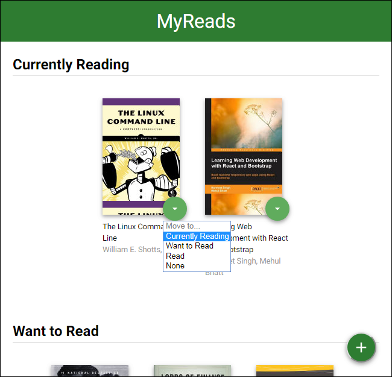
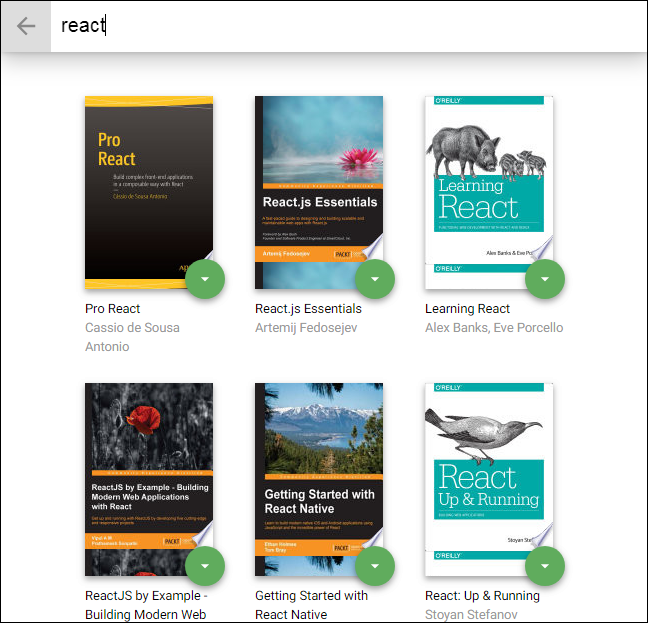

# Reading Tracking App

You can have three feature to track:
- Currently Reading
- Want to Read
- Read

---------
## Screenshots

## Installation

Clone the repository, change directories, and use NPM to install the dependencies.
- Clone/Download this repo.
- Run `npm install`or `yarn install` in the project directory to install dependencies.

## Start
- The project can be run with `npm start`
- Then it can be viewed in the browser at [http://localhost:3000](http://localhost:3000)
